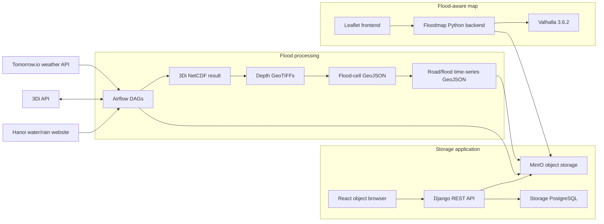

# Current Architecture and Functional Feature Inventory

**Repository:** `airflow_new`  
**Review date:** 2026-07-12  
**Reviewed revision:** `f8ac2e3` (`main`)  
**Scope:** current checked-in code and top-level integrated Docker Compose deployment

## 1. Executive summary

This repository is an integrated flood-processing and flood-aware routing platform. It combines three product areas:

1. **Flood data production:** Apache Airflow orchestrates weather retrieval, 3Di simulations, NetCDF download, raster water-depth calculation, GeoJSON production, road/flood intersection, and MinIO upload.
2. **Storage and access management:** MinIO stores generated data; a Django REST API and React UI provide authenticated object browsing, role/group/prefix access control, uploads, downloads, sharing, tags, versions, and historical rewind views.
3. **Flood visualization and routing:** a lightweight Python backend loads the newest road-flood GeoJSON from MinIO, converts depths into vehicle-specific routing costs, calls Valhalla, and serves a Leaflet UI with flood layers, route alternatives, directions, depth forecasts, and departure recommendations.

The integration point is **MinIO**. Airflow writes timestamped flood-road GeoJSON objects to MinIO; the floodmap backend discovers and reads the newest matching object. The Django/React application provides human administration and inspection of the same object store. The complete service topology is declared in [compose.yml](compose.yml#L1-L355).

### Current-state assessment

| Area | Status | Summary |
|---|---|---|
| Integrated Compose topology | Implemented and statically validated | Sixteen service definitions/one-shot jobs, health/dependency wiring, four named volumes |
| Storage application | Implemented with backend tests | Cookie JWT auth, RBAC, groups/grants, object operations, pagination, versions and rewind UI |
| Floodmap visualization | Implemented | MinIO/fallback loading, flood layers, multi-vehicle route forecast, Leaflet UI |
| Valhalla flood constraints | Implemented but partly feature-flagged | Soft `linear_cost_factors` active; hard `exclude_locations` disabled by default |
| Main Airflow mapping flow | Partially production-wired | Full seven-stage path exists, but its depth step currently reads a fixed local NetCDF fixture rather than the file downloaded by the prior task |
| Other Airflow DAGs | Mixed | Forecast, initial-water-level, dummy-data, and manhole flows exist; the checked-in test DAG has runtime defects and should not be considered operational |

## 2. System context and data flow



The primary intended flood path is:

```text
Tomorrow.io rain forecast
  -> 3Di simulation (cold start or previous saved-state hot start)
  -> results_3di.nc
  -> per-timestep depth GeoTIFFs
  -> per-timestep flood polygons
  -> merged time-series flood polygons
  -> intersection with Hanoi road LineStrings
  -> road LineStrings carrying [{time, depth}, ...]
  -> s3://<flood-bucket>/<run_ts>/flood_road_<run_ts>.geojson
  -> floodmap refresh
  -> vehicle-specific costs and Valhalla routes
```

Code references: simulation creation and polling in [create_simulation.py](airflow_tsm/scripts/create_simulation.py#L111-L285), depth processing in [calculate_depth.py](airflow_tsm/scripts/calculate_depth.py#L55-L124), road/flood intersection in [mapping_geojson.py](airflow_tsm/scripts/mapping/mapping_geojson.py#L14-L163), timestamped upload in [upload_minio.py](airflow_tsm/scripts/mapping/upload_minio.py#L63-L103), and newest-object loading in [server.py](floodmap/valhalla-flood-road-test/backend/server.py#L67-L138).

## 3. Deployment architecture

### 3.1 Service inventory

| Service | Technology / role | Host exposure | Persistence / dependencies |
|---|---|---:|---|
| `minio` | MinIO S3-compatible object store | `127.0.0.1:9000`, console `127.0.0.1:9001` by default | `minio-data` named volume |
| `minio-init` | MinIO client one-shot initializer | None | Creates flood, initial-WL, and manhole buckets |
| `storage-postgres` | PostgreSQL 17 for Django | Loopback host port, default `5432` (`5433` in example env) | `storage-postgres-data` |
| `storage-backend` | Django REST API via Gunicorn | `8000` | PostgreSQL + MinIO |
| `storage-frontend` | Vite/React build served by nginx | `5173` | Proxies `/api/` to Django |
| `airflow-postgres` | PostgreSQL 16 for Airflow metadata/results | Internal only | `airflow-postgres-data` |
| `airflow-redis` | Celery broker | Internal only | Ephemeral |
| `airflow-apiserver` | Airflow 3.1.7 API/UI | `8080` | Airflow DB, Redis, MinIO initialization |
| `airflow-scheduler` | Airflow scheduler | Internal only | Airflow DB and DAG files |
| `airflow-dag-processor` | Parses DAG files | Internal only | Mounted DAG directory |
| `airflow-worker` | Celery task execution | Internal only | Mounted scripts/data; concurrency defaults to one |
| `airflow-init` | DB migration, user creation, directory ownership | One-shot | Runs before Airflow services |
| `airflow-trigger-flood-mapping` | Startup activation | One-shot | Unpauses `flood_mapping_full`; its continuous timetable creates runs |
| `valhalla` | Valhalla 3.6.2 routing engine | `8002` | Bind-mounted Hanoi PBF/config/tiles |
| `floodmap-backend` | Threaded Python HTTP API | `8010` | MinIO + Valhalla; bundled GeoJSON fallback |
| `floodmap-frontend` | Static Leaflet application via nginx | `8081` | Proxies `/api/` to floodmap backend |

The MinIO/storage services are defined in [compose.yml](compose.yml#L61-L165), Airflow services in [compose.yml](compose.yml#L167-L301), and routing services in [compose.yml](compose.yml#L303-L349).

### 3.2 Networking and same-origin proxies

- The storage frontend nginx proxies `/api/` to `storage-backend:8000`, allowing cookie-based auth through one browser origin: [nginx.conf](minio_custom/frontend/nginx.conf#L1-L27).
- The floodmap frontend nginx rewrites `/api/<path>` to `floodmap-backend:8010/<path>` and uses long proxy timeouts for route calculation: [nginx.conf](floodmap/valhalla-flood-road-test/frontend/nginx.conf#L1-L39).
- MinIO API and console default to loopback bindings, while the user-facing frontends and application APIs bind their configured host ports: [compose.yml](compose.yml#L62-L72), [compose.yml](compose.yml#L116-L164).
- Valhalla is exposed on the host as well as used internally at `http://valhalla:8002`: [compose.yml](compose.yml#L303-L338).

### 3.3 Persistent and mounted state

| State | Storage | Purpose |
|---|---|---|
| MinIO objects | `minio-data` named volume | Flood outputs, initial water levels, manhole/rain CSVs, user-managed objects |
| Django records | `storage-postgres-data` | Users, profiles, access groups, visibility grants |
| Airflow metadata/results | `airflow-postgres-data` | DAG runs, tasks, Celery result backend |
| Airflow logs | `airflow-logs` | Scheduler/worker/task logs |
| DAGs/scripts/data | Host bind mounts under `airflow_tsm/` | Live code and geospatial inputs/intermediate outputs |
| Valhalla graph | `floodmap/.../valhalla/custom_files` bind mount | Hanoi PBF, config and built routing tiles |

Volume definitions are at [compose.yml](compose.yml#L351-L355); Airflow bind mounts are at [compose.yml](compose.yml#L45-L51).

## 4. Airflow flood-processing subsystem

### 4.1 Runtime architecture

Airflow uses **CeleryExecutor**, Redis as broker, PostgreSQL as metadata/result store, and a single worker concurrency by default. All Airflow services share environment, DAG, script, data and log mounts through the `x-airflow-common` anchor: [compose.yml](compose.yml#L2-L59).

The custom image is based on Airflow 3.1.7 and installs GDAL/geospatial dependencies, Chrome/Selenium, Tesseract OCR, 3Di libraries, GeoPandas, Rasterio and OpenCV headless: [Dockerfile](airflow_tsm/Dockerfile#L14-L82), [requirements.txt](airflow_tsm/requirements.txt#L1-L19).

### 4.2 DAG catalog

There is no `.airflowignore` in the current `airflow_tsm/dags` directory, so all six Python DAG files are candidates for parsing/loading.

| DAG | Schedule | Functional purpose | Current status |
|---|---|---|---|
| `flood_mapping_full` | Continuous after prior run | Rain-gated 3Di-to-road-flood-to-MinIO pipeline | Uses `@continuous`; dry cycles wait without creating a simulation; partially fixture-bound |
| `flood_forecast_pipeline` | Every 30 min | 3Di -> downloaded NetCDF -> depth -> GeoJSON -> merged MinIO output | Uses downloaded NetCDF correctly, but produces flood-cell output rather than road-aware output |
| `flood_initial_wl_pipeline` | Every 30 min | Load latest initial-WL CSV, create 3Di resource, simulate, download, calculate depth, rename output | Implemented; requires valid APIs/data |
| `initial_wl_dummy_pipeline` | Every 10 min | Generate random water levels for 22 nodes and upload CSV | Implemented synthetic producer |
| `manholes_waterlevel_rain_pipeline` | Every 2 hours | Selenium/OCR scrape of Hanoi water/rain stations, CSV output and MinIO upload | Implemented; operationally depends on live website/browser behavior |
| `flood_forecast_pipeline_test` | Every 30 min | Fixture-based mapping test path | Not operational as checked in; see limitations |

References: [flood_mapping_dag.py](airflow_tsm/dags/flood_mapping_dag.py#L192-L224), [flood_forecast_dag.py](airflow_tsm/dags/flood_forecast_dag.py#L124-L151), [initial_wl_dag.py](airflow_tsm/dags/initial_wl_dag.py#L195-L231), [dummy_initial_wl_dag.py](airflow_tsm/dags/dummy_initial_wl_dag.py#L25-L50), [manholes_dag.py](airflow_tsm/dags/manholes_dag.py#L23-L53), and [test_dag.py](airflow_tsm/dags/test_dag.py#L215-L246).

### 4.3 Main rain-gated seven-stage mapping DAG

`flood_mapping_full` first evaluates a Tomorrow.io forecast gate. If every forecast interval is below 5 mm/h, the simulation-through-upload branch is skipped and a reschedule-mode wait completes the cycle successfully. Airflow's `@continuous` timetable then starts the next cycle. Qualifying forecasts enter these seven sequential tasks:

1. **Trigger simulation:** fetch a Tomorrow.io precipitation forecast, select a 3Di simulation template, optionally hot-start from the prior saved state, create/start the simulation, poll it, and persist the newly scheduled state ID.
2. **Download results:** discover the 3Di result file and stream it to the mounted results directory.
3. **Calculate depth:** use `threedidepth` and `GridH5ResultAdmin` to calculate water-depth GeoTIFFs in a UUID directory using multiprocessing.
4. **Extract full GeoJSON:** convert raster cells with non-negative/non-NoData depth into polygon features. `SAMPLE_RATE` and `MAX_WORKERS` control granularity/parallelism.
5. **Merge GeoJSON:** merge per-timestep files into one time-series flood polygon dataset and upload an intermediate `flood_<run_ts>.geojson`.
6. **Map flood to roads:** intersect Hanoi road LineStrings with flood polygons and attach sorted `{time, depth}` time series to each resulting road segment.
7. **Upload road result:** upload `flood_road_<run_ts>.geojson` under a timestamp folder and clean selected local intermediates.

Task definitions and XCom path passing are in [flood_mapping_dag.py](airflow_tsm/dags/flood_mapping_dag.py#L37-L180); the dependency chain is at [flood_mapping_dag.py](airflow_tsm/dags/flood_mapping_dag.py#L203-L224).

### 4.4 Simulation behavior

Implemented simulation features include:

- Tomorrow.io precipitation retrieval over a configurable two-hour lookahead at 15-minute timesteps.
- A deterministic 5 mm/h gate before any 3Di simulation call; qualifying forecast intervals are reused by the simulation task rather than fetched twice.
- Dry-cycle reschedule waiting, defaulting to 15 minutes, before the continuous timetable starts another cycle.
- Conversion from millimetres/hour to metres/second for 3Di rain events.
- 3Di template lookup by model ID.
- Cold start from template or hot start from a previously saved-state ID.
- Timed saved-state creation for rolling forecasts.
- Start action and ten-second status polling until finish/failure.
- State-file persistence under `/opt/airflow/state/flood_system_state.json`.

See [create_simulation.py](airflow_tsm/scripts/create_simulation.py#L31-L75), [create_simulation.py](airflow_tsm/scripts/create_simulation.py#L111-L185), and [create_simulation.py](airflow_tsm/scripts/create_simulation.py#L187-L285).

### 4.5 Depth and geospatial transformation

- Each NetCDF time index is processed into a water-depth raster through `calculate_waterdepth`; timestamp metadata is used to rename output files: [calculate_depth.py](airflow_tsm/scripts/calculate_depth.py#L20-L83).
- A UUID isolates every calculation run, and `MAX_WORKERS` controls the multiprocessing pool: [calculate_depth.py](airflow_tsm/scripts/calculate_depth.py#L86-L124).
- The full extractor samples cells according to `SAMPLE_RATE`, emits cell polygons and preserves the depth property: [extract_geojson_full.py](airflow_tsm/scripts/mapping/extract_geojson_full.py#L22-L73).
- Road mapping uses a flood spatial index, bounding-box candidate selection, precise geometry intersection, and safe JSON export with no NaN values: [mapping_geojson.py](airflow_tsm/scripts/mapping/mapping_geojson.py#L37-L158).

### 4.6 Other ingestion features

**Initial water levels**

- A dummy producer creates 22 random node water levels and uploads a timestamped CSV to the configurable initial-WL bucket/prefix: [generate_initial_wl.py](airflow_tsm/scripts/initial_wl/generate_initial_wl.py#L17-L72).
- The consumer lists that prefix, downloads the newest CSV, transforms values into a 3Di initial-water-level resource and uploads the data through 3Di APIs: [apply_initial_wl.py](airflow_tsm/scripts/initial_wl/apply_initial_wl.py#L42-L148).
- A dedicated simulation path applies that resource, adds forecast rain, starts/monitors a simulation, downloads output and calculates depths: [initial_wl_dag.py](airflow_tsm/dags/initial_wl_dag.py#L39-L183).

**Manhole/water/rain observations**

- Selenium opens Hanoi drainage-site water-level and rain pages.
- OCR extracts image-based readings.
- Results are written to two CSVs and uploaded under one timestamp folder in the manhole bucket.

See [XuLyTramDo.py](airflow_tsm/scripts/manholes/XuLyTramDo.py#L23-L82), [XuLyTramDo.py](airflow_tsm/scripts/manholes/XuLyTramDo.py#L145-L198), and [XuLyTramDo.py](airflow_tsm/scripts/manholes/XuLyTramDo.py#L203-L259).

### 4.7 MinIO output contracts

| Producer | Object pattern |
|---|---|
| Road-aware flood mapping | `s3://<FLOOD_MINIO_BUCKET>/<run_ts>/flood_road_<run_ts>.geojson` |
| Intermediate/legacy flood merge | `s3://<FLOOD_MINIO_BUCKET>/<run_ts>/flood_<run_ts>.geojson` |
| Dummy initial water level | `s3://<INITIAL_WL_MINIO_BUCKET>/<INITIAL_WL_MINIO_PREFIX>/initial_wl_<timestamp>.csv` |
| Manhole water level | `s3://<MANHOLES_MINIO_BUCKET>/<timestamp>/waterlevel_<timestamp>.csv` |
| Rain observations | `s3://<MANHOLES_MINIO_BUCKET>/<timestamp>/rain_<timestamp>.csv` |

The road-flood key is constructed in [upload_minio.py](airflow_tsm/scripts/mapping/upload_minio.py#L81-L103); manhole keys are constructed in [XuLyTramDo.py](airflow_tsm/scripts/manholes/XuLyTramDo.py#L221-L259).

## 5. MinIO storage and access-management subsystem

### 5.1 Architecture

```text
Browser
  -> nginx React SPA (:5173)
  -> same-origin /api proxy
  -> Gunicorn + Django REST Framework (:8000)
       -> PostgreSQL: identities, roles, groups, grants
       -> MinIO S3 API: buckets, objects, tags, versions, presigned URLs
```

The backend uses PostgreSQL exclusively in the integrated stack and authenticates API requests with JWTs stored in HTTP-only cookies. Django settings, database selection, DRF defaults, CORS/CSRF and MinIO configuration are in [settings.py](minio_custom/backend/config/settings.py#L12-L138).

### 5.2 Authentication and session features

- Login returns access/refresh JWTs as HTTP-only cookies.
- Refresh reads the refresh token from the cookie when not explicitly supplied.
- Logout clears both cookies.
- Public registration is deliberately disabled with HTTP 403.
- A `/api/me/` endpoint reports identity, effective role and coarse UI permissions.
- Unsafe cookie-authenticated requests enforce CSRF; the frontend sends the `csrftoken` cookie as `X-CSRFToken` and always includes credentials.

References: [views.py](minio_custom/backend/storage_api/views.py#L206-L309), [authentication.py](minio_custom/backend/storage_api/authentication.py#L7-L26), and [api.js](minio_custom/frontend/src/api.js#L1-L51).

### 5.3 Role, group and visibility model

Four effective account levels exist:

| Role | Administrative ability | Storage behavior |
|---|---|---|
| Django superuser | Manage admins, editors, viewers and all grants | Unrestricted read/write |
| `admin` | Manage editors/viewers, groups and grants; cannot manage admins/superusers | Unrestricted read/write |
| `editor` | No user administration | Read/write only where a matching write grant exists; read grants also permit read |
| `viewer` | No user administration | Read only where a matching read/write grant exists |

The persistent model consists of:

- `UserProfile`: one-to-one role record with indexed `role`.
- `AccessGroup`: named many-to-many grouping of users.
- `VisibilityGrant`: target type (`role`, `user`, or `group`), bucket, optional prefix, and `read`/`write` access.
- Database constraints enforce a valid single target and uniqueness per target/bucket/prefix/access tuple.

See [models.py](minio_custom/backend/storage_api/models.py#L6-L38) and [models.py](minio_custom/backend/storage_api/models.py#L41-L114).

Access checking is boundary-aware: a grant for `reports` matches `reports` and `reports/...`, not `reports-old`. Administrators bypass grants; read checks accept either read or write grants. Object responses are filtered after MinIO listing, and writable prefixes are returned to the UI: [views.py](minio_custom/backend/storage_api/views.py#L101-L203).

### 5.4 Administrative features

- Paginated/filterable user list; create, edit and deactivate users.
- Superuser-only creation/management of admins.
- Paginated/filterable access-group list with member counts/previews; create/edit/delete groups.
- Paginated/filterable visibility grants; create/edit/delete role-, user-, or group-targeted grants.
- Create buckets as either open to all editors/viewers or restricted to a selected group.
- Admin UI tabs for users, groups and grants with search, filters and page-size controls.

Backend implementation: [views.py](minio_custom/backend/storage_api/views.py#L312-L488), [views.py](minio_custom/backend/storage_api/views.py#L491-L549). Frontend implementation: [main.jsx](minio_custom/frontend/src/main.jsx#L312-L774), [main.jsx](minio_custom/frontend/src/main.jsx#L1125-L1367).

### 5.5 Object-browser features

**Buckets and navigation**

- List only accessible buckets.
- Create and delete buckets for administrators.
- Client-side routes for login/browser/bucket views.
- Prefix-based folder navigation, parent navigation, path copy and name filtering.
- Folder upload preserves browser `webkitRelativePath` structure.
- “Create path” creates a pending client-side prefix; it persists only once an object is uploaded under it.

**Object operations**

- Paginated object listing using MinIO continuation tokens and configurable `max_keys` bounded to 1–1000.
- Per-object `head_object` lookup for content type and user metadata.
- Single or folder upload with browser-provided content type.
- Single/multi-select download and deletion; folder deletion iterates objects under the prefix.
- Object detail panel with size, modification date, content type, metadata and tags.
- Transfer panel for upload/download status.

**Sharing and preview**

- Presigned GET links with expiry clamped between 60 seconds and seven days.
- Preview links set inline content-disposition and inferred MIME type.
- Share link copying and in-modal preview.
- Public link origin comes from `MINIO_PUBLIC_ENDPOINT`, not the internal Compose hostname.

**Tags, versions and history**

- Read and replace MinIO object tags.
- List object versions and delete/download/share/preview a specific version.
- Multi-select version deletion.
- Bucket “rewind” reconstructs the newest non-deleted object version at or before a supplied timestamp.

Backend object implementation: [views.py](minio_custom/backend/storage_api/views.py#L565-L748), [views.py](minio_custom/backend/storage_api/views.py#L751-L867). Frontend API contract: [api.js](minio_custom/frontend/src/api.js#L140-L239). Main UI handlers: [main.jsx](minio_custom/frontend/src/main.jsx#L1445-L1611), [main.jsx](minio_custom/frontend/src/main.jsx#L1661-L2038).

### 5.6 Storage API reference

All routes below are under `/api`; all except auth endpoints require authentication.

| Method | Route | Function |
|---|---|---|
| `POST` | `/auth/token/` | Login and set JWT cookies |
| `POST` | `/auth/token/refresh/` | Refresh access cookie |
| `POST` | `/auth/logout/` | Clear auth cookies |
| `GET` | `/me/` | Current identity/role/permissions |
| `GET, POST` | `/users/` | List/create users |
| `GET, PATCH, DELETE` | `/users/<id>/` | Inspect/update/deactivate user |
| `GET, POST` | `/groups/` | List/create access groups |
| `GET, PATCH, DELETE` | `/groups/<id>/` | Inspect/update/delete group |
| `GET, POST` | `/visibility-grants/` | List/create grants |
| `GET, PATCH, DELETE` | `/visibility-grants/<id>/` | Inspect/update/delete grant |
| `GET, POST` | `/buckets/` | List accessible/create bucket |
| `DELETE` | `/buckets/<bucket>/` | Delete bucket |
| `GET` | `/buckets/<bucket>/rewind/` | Historical object set at `rewind_to` |
| `GET, POST, DELETE` | `/buckets/<bucket>/objects/` | List/upload/delete objects |
| `GET` | `/buckets/<bucket>/objects/download/` | Stream object/version download |
| `GET` | `/buckets/<bucket>/objects/share/` | Create presigned share/preview URL |
| `GET, PUT` | `/buckets/<bucket>/objects/tags/` | Read/replace tags |
| `GET` | `/buckets/<bucket>/objects/versions/` | List versions/delete markers |

Canonical route declarations: [config/urls.py](minio_custom/backend/config/urls.py#L12-L18) and [storage_api/urls.py](minio_custom/backend/storage_api/urls.py#L18-L39).

## 6. Floodmap and flood-aware routing subsystem

### 6.1 Architecture

The floodmap backend is intentionally small: Python’s `ThreadingHTTPServer` serves JSON and calls MinIO/Valhalla directly. It does not have its own database. One process-level `FloodConstraintAdapter` caches the loaded GeoJSON and refreshes it at a configurable interval, default 30 seconds: [server.py](floodmap/valhalla-flood-road-test/backend/server.py#L56-L85), [server.py](floodmap/valhalla-flood-road-test/backend/server.py#L816-L816).

At refresh time it:

1. Paginates the configured MinIO bucket/prefix.
2. Selects keys whose filename matches `flood_road_*.geojson` and which live under a folder.
3. Sorts candidates by MinIO `LastModified` descending.
4. Loads the newest object, or the newest non-empty object in `nonempty`/`rain` mode.
5. Falls back to the bundled sample GeoJSON only for ordinary mode when MinIO loading fails.

See [server.py](floodmap/valhalla-flood-road-test/backend/server.py#L67-L138).

### 6.2 Flood data contract

The backend expects a GeoJSON `FeatureCollection` of road-aware `LineString` features:

```json
{
  "type": "Feature",
  "geometry": { "type": "LineString", "coordinates": [[105.0, 21.0], [105.1, 21.1]] },
  "properties": {
    "road_name": "...",
    "timeseries": [
      { "time": "2026-05-22T18:00:00", "depth": 0.12 }
    ]
  }
}
```

The Airflow road mapper generates exactly this shape: [mapping_geojson.py](airflow_tsm/scripts/mapping/mapping_geojson.py#L118-L149). The routing parser extracts time steps and builds typed flood features in [flood_utils.py](floodmap/valhalla-flood-road-test/scripts/flood_utils.py#L114-L173).

### 6.3 Vehicle and depth model

| Vehicle | Valhalla costing | Unsafe threshold |
|---|---|---:|
| Motorbike | `motor_scooter` | 20 cm |
| Car | `auto` | 30 cm |
| Truck | `truck` | 50 cm |

For each vehicle, water depth is normalized against its threshold and converted to factors `1`, `2`, `8`, `25`, `60`, or `100`. Factor 1 is omitted from routing constraints but retained for visualization/forecast analysis: [flood_utils.py](floodmap/valhalla-flood-road-test/scripts/flood_utils.py#L24-L43), [flood_utils.py](floodmap/valhalla-flood-road-test/scripts/flood_utils.py#L98-L111), [flood_utils.py](floodmap/valhalla-flood-road-test/scripts/flood_utils.py#L145-L187).

### 6.4 Routing features

**Baseline and flood-aware routing**

- Baseline calls Valhalla with origin, destination and vehicle costing.
- Flood-aware routing builds flood factors for the requested time.
- It begins with the deepest features, then prefers features within 30 metres of the baseline route.
- At most four route constraints are used by default.
- Constraints are sent as Valhalla `linear_cost_factors` for soft avoidance.
- Dangerous features are also converted to `exclude_locations`, but those hard blocks are only included when `FLOOD_USE_HARD_EXCLUDES=true`; the integrated Compose file does not currently set it, so the default is soft avoidance only.
- If a constrained route fails, the backend halves the constraint set until a route succeeds, then finally falls back to an unconstrained route with a warning.

See [server.py](floodmap/valhalla-flood-road-test/backend/server.py#L619-L674) and [server.py](floodmap/valhalla-flood-road-test/backend/server.py#L765-L813).

**Route comparison**

- Computes baseline and flood-aware summaries.
- Measures route exposure by testing route/flood-segment proximity (12 m default).
- Returns `PASS` only when the route changed and either maximum depth or affected-road count decreased.
- Reports distances, durations, maximum depths, affected road counts, selected linear factors and hard-exclusion metadata.

See [server.py](floodmap/valhalla-flood-road-test/backend/server.py#L676-L763) and exposure geometry in [flood_utils.py](floodmap/valhalla-flood-road-test/scripts/flood_utils.py#L476-L506).

**Multi-vehicle route forecast**

- Produces motorbike, car and truck candidate routes.
- Requests up to two Valhalla alternatives and generates additional variants by excluding points on the baseline route.
- Deduplicates routes by shape and sorts them primarily by maximum flood depth, then duration and distance.
- Annotates individual maneuvers with maximum depth and affected-road count.
- Generates eight 30-minute histogram windows (four hours visible).
- Scans twelve windows (six hours) for the first safe departure opportunity.
- Marks forecast bars stale when the exact time step is absent and the newest available step is reused.

See [server.py](floodmap/valhalla-flood-road-test/backend/server.py#L170-L248), [server.py](floodmap/valhalla-flood-road-test/backend/server.py#L250-L370), and [server.py](floodmap/valhalla-flood-road-test/backend/server.py#L505-L617).

### 6.5 Floodmap API reference

| Method | Route | Function |
|---|---|---|
| `GET` | `/health` | Backend status, Valhalla URL, data bounding box and active GeoJSON source |
| `GET` | `/flood/timesteps` | Available/latest time steps and source metadata |
| `GET` | `/flood/roads` | Styled road LineStrings for time/vehicle |
| `GET` | `/flood/polygons` | Display polygons buffered from road LineStrings |
| `GET` | `/flood/route/forecast` | Multi-vehicle candidates, ETA/distance, forecasts and best departure |
| `POST` | `/route/baseline` | Plain Valhalla route |
| `POST` | `/route/flood-aware` | Valhalla route with flood factors |
| `POST` | `/route/compare` | Baseline/flood-aware comparison and decision |

The HTTP dispatch implementation is in [server.py](floodmap/valhalla-flood-road-test/backend/server.py#L830-L944).

### 6.6 Leaflet frontend features

- OpenStreetMap base map with independently toggleable flood polygons, flooded roads, recommended/alternate routes, shared segments and markers.
- Origin/destination text entry plus map-based point picking.
- Data-source display showing the loaded MinIO/fallback filename and modification time.
- Toggle between latest data and non-empty/rain-source mode.
- Motorbike/car/truck tabs with vehicle thresholds and ETAs.
- Up to three selectable route alternatives per vehicle.
- Route distance, duration, maximum crossed depth and affected-road indicators.
- Four-hour water-depth histogram and six-hour best-departure recommendation.
- Turn-by-turn directions with flood-depth annotations per maneuver.
- Automatic route fitting and custom route styling.

Data loading is in [app.js](floodmap/valhalla-flood-road-test/frontend/app.js#L275-L380), forecast rendering in [app.js](floodmap/valhalla-flood-road-test/frontend/app.js#L396-L566), route drawing in [app.js](floodmap/valhalla-flood-road-test/frontend/app.js#L574-L650), and interaction wiring in [app.js](floodmap/valhalla-flood-road-test/frontend/app.js#L704-L758).

## 7. Configuration model

The checked-in [.env.example](.env.example#L1-L49) groups settings into:

- MinIO credentials, bucket names and ports.
- Django secret/debug/database/Gunicorn settings.
- Airflow UID/UI credentials and execution timeouts.
- Simulation identifiers and Tomorrow.io/3Di credentials.
- Processing controls such as `MAX_WORKERS`, `SAMPLE_RATE`, simulation duration and update interval.
- Frontend/backend/Valhalla host ports.
- Floodmap MinIO prefix and local fallback file.

Important wiring notes:

- `MAX_WORKERS`, `SAMPLE_RATE`, `SIMULATION_DURATION` and `UPDATE_INTERVAL` are consumed by processing code.
- `FLOOD_RAIN_THRESHOLD_MM_HR`, `FLOOD_RAIN_LOOKAHEAD_HOURS`, `FLOOD_RAIN_TIMESTEP_MINUTES`, and `FLOOD_RAIN_CHECK_INTERVAL_SECONDS` configure the main DAG's forecast gate. `FLOOD_TEST_RAIN_MM_HR` bypasses the live weather call for deterministic local testing.
- `flood_mapping_full` uses Airflow's `@continuous` timetable rather than a cron schedule. The separate legacy/test DAGs retain their own schedules.
- `FLOOD_USE_DOWNLOADED_RESULTS` is passed by Compose but is not read by the current code.
- `MIN_DEPTH_THRESHOLD` is active in the legacy extractor, but the main mapping DAG uses `mapping/extract_geojson_full.py`, where that setting is commented out. It therefore does not filter the primary mapping path.
- `LOCAL_GEOJSON_DIR` and `KEEP_LOCAL_GEOJSON` are passed by Compose but are not read by the checked-in Airflow scripts.
- Floodmap feature flags such as `FLOOD_USE_HARD_EXCLUDES`, `FLOOD_PROBE_EDGE_WALKABLE`, and constraint limits exist in code but are not exposed in `.env.example` or top-level Compose.

References: environment pass-through in [compose.yml](compose.yml), continuous scheduling and rain branching in [flood_mapping_dag.py](airflow_tsm/dags/flood_mapping_dag.py), the legacy schedule in [flood_forecast_dag.py](airflow_tsm/dags/flood_forecast_dag.py#L124-L132), inactive threshold in [extract_geojson_full.py](airflow_tsm/scripts/mapping/extract_geojson_full.py#L22-L23), and routing flags in [server.py](floodmap/valhalla-flood-road-test/backend/server.py#L23-L26).

## 8. Implemented, conditional, and known limitations

### 8.1 Implemented and directly evidenced

- Integrated service configuration resolves with `.env.example`.
- MinIO bucket initialization and routing contracts have automated tests.
- Storage API has tests for cookie auth/CSRF, role restrictions, pagination, indexes, group queries, bucket restrictions, prefix-boundary access, object pagination/key validation, preview filename safety, and editor/user grants: [tests.py](minio_custom/backend/storage_api/tests.py#L29-L561).
- Bundled sample flood data contains 1,200 valid LineStrings and two time steps.
- Checked-in Valhalla requests/responses and comparison tooling support baseline, constrained and negative-control testing: [run_route_tests.py](floodmap/valhalla-flood-road-test/scripts/run_route_tests.py#L1-L123), [compare_routes.py](floodmap/valhalla-flood-road-test/scripts/compare_routes.py#L1-L99).

### 8.2 Conditional on external systems/data

- Live forecast runs require valid Tomorrow.io and 3Di credentials, compatible model/template IDs and reachable APIs.
- The manhole pipeline requires the target website’s current DOM/image behavior, Chrome and OCR.
- Flood-aware routing requires the Valhalla service and compatible Hanoi graph tiles.
- Historical rewind and useful versions UI require MinIO bucket versioning; the repository does not enable versioning during bucket creation.
- Presigned share links require `MINIO_PUBLIC_ENDPOINT` to be reachable by the end user.
- The floodmap backend has permissive `Access-Control-Allow-Origin: *` and no authentication; deployment protection must be supplied externally if required.

### 8.3 Current code gaps and risks

1. **Main mapping DAG ignores its downloaded result.** `task_download_result` stores `nc_path`, but `task_calculate_depth` comments out the XCom pull and uses `/opt/airflow/data/mapping/results/results_3di.nc`: [flood_mapping_dag.py](airflow_tsm/dags/flood_mapping_dag.py#L46-L68). A successful download therefore does not guarantee the next task processes that file.
2. **The startup trigger masks failure.** Both `unpause` and `trigger` end in `|| true`, so the one-shot container can exit successfully even if the DAG was not parsed or triggered: [compose.yml](compose.yml#L285-L301).
3. **The test DAG is scheduled but has runtime errors.** It uses `pd` without importing pandas, references `ROADS_GEOJSON_PATH` without defining it, and pulls XCom from `4_extract_geojson_full` although its task is named `4_extract_geojson`: [test_dag.py](airflow_tsm/dags/test_dag.py#L120-L166), [test_dag.py](airflow_tsm/dags/test_dag.py#L215-L246).
4. **Some documented knobs are inert.** Schedule selection, downloaded-result selection, local-output retention and the primary-path depth threshold are not wired as described in Section 7.
5. **Embedded fallback API credentials exist in source.** `create_simulation.py` includes non-empty fallback values for external API credentials. They should be removed/rotated and environment variables made mandatory: [create_simulation.py](airflow_tsm/scripts/create_simulation.py#L14-L24). This document intentionally does not reproduce them.
6. **Object listing has an N+1 S3 pattern.** Every listed object triggers a `head_object`, increasing latency/egress for large pages: [views.py](minio_custom/backend/storage_api/views.py#L676-L700).
7. **Rewind/version listing is not paginated at the S3 layer.** `list_object_versions` is called once, so buckets beyond one MinIO response page may yield incomplete history: [views.py](minio_custom/backend/storage_api/views.py#L580-L637), [views.py](minio_custom/backend/storage_api/views.py#L826-L867).
8. **Hard flood blocking is off by default.** The API computes dangerous-road exclusion locations but only applies them when `FLOOD_USE_HARD_EXCLUDES=true`; Compose currently leaves it false: [server.py](floodmap/valhalla-flood-road-test/backend/server.py#L23-L26), [server.py](floodmap/valhalla-flood-road-test/backend/server.py#L658-L665).
9. **Route-forecast alternatives are partly synthetic detours.** Besides Valhalla alternatives, the backend generates variants by excluding points at roughly 33% and 66% along the baseline route. They are useful alternatives, but not independently optimized flood-aware routes: [server.py](floodmap/valhalla-flood-road-test/backend/server.py#L349-L370).
10. **Frontend test automation is absent.** The React UI has build tooling but no unit/E2E test script in [package.json](minio_custom/frontend/package.json#L1-L20).

## 9. Verification performed for this review

| Check | Result | Meaning |
|---|---|---|
| `docker compose --env-file .env.example config --quiet` | Passed | Top-level Compose syntax/interpolation/dependency model resolves |
| Python `compileall` over Airflow, Django, flood backend and scripts | Passed | Checked Python sources are syntactically valid |
| `python -m unittest discover -s airflow_tsm/test -p test_minio_bucket_routing.py -v` | 4 passed | Bucket names/prefixes and Compose routing contracts agree |
| `scripts/inspect_flood_geojson.py` | Passed | 1,200 LineStrings; two time steps; no invalid time-series/depth/coordinate warnings |
| `scripts/extract_timesteps.py` | Passed | Extracted `2026-05-22T18:00:00` and `2026-05-22T19:00:00` |
| Django backend suite | Not executed | Current host runtime lacks Django; code/tests were inspected but not run |
| React production build | Not executed | `node_modules` is absent in the checkout; no dependency install was performed |
| Live Docker stack / external APIs | Not executed | Review did not start services or spend external API calls |

The validation claims above are deliberately limited to what was actually run. Compose resolution does not prove images build or services start, and static compilation does not prove runtime integrations.

## 10. Code map for maintainers

| Concern | Primary files |
|---|---|
| Full deployment | [compose.yml](compose.yml), [.env.example](.env.example), [README.md](README.md) |
| Airflow image/dependencies | [Dockerfile](airflow_tsm/Dockerfile), [requirements.txt](airflow_tsm/requirements.txt) |
| Main flood mapping DAG | [flood_mapping_dag.py](airflow_tsm/dags/flood_mapping_dag.py) |
| Forecast/initial/manhole DAGs | [flood_forecast_dag.py](airflow_tsm/dags/flood_forecast_dag.py), [initial_wl_dag.py](airflow_tsm/dags/initial_wl_dag.py), [manholes_dag.py](airflow_tsm/dags/manholes_dag.py) |
| 3Di/weather integration | [create_simulation.py](airflow_tsm/scripts/create_simulation.py), [download_result.py](airflow_tsm/scripts/download_result.py) |
| Raster/GeoJSON processing | [calculate_depth.py](airflow_tsm/scripts/calculate_depth.py), [extract_geojson_full.py](airflow_tsm/scripts/mapping/extract_geojson_full.py), [mapping_geojson.py](airflow_tsm/scripts/mapping/mapping_geojson.py) |
| MinIO pipeline outputs | [upload_minio.py](airflow_tsm/scripts/mapping/upload_minio.py), [generate_initial_wl.py](airflow_tsm/scripts/initial_wl/generate_initial_wl.py), [XuLyTramDo.py](airflow_tsm/scripts/manholes/XuLyTramDo.py) |
| Storage domain model | [models.py](minio_custom/backend/storage_api/models.py), [serializers.py](minio_custom/backend/storage_api/serializers.py) |
| Storage API/access rules | [views.py](minio_custom/backend/storage_api/views.py), [urls.py](minio_custom/backend/storage_api/urls.py), [authentication.py](minio_custom/backend/storage_api/authentication.py) |
| Storage browser | [main.jsx](minio_custom/frontend/src/main.jsx), [api.js](minio_custom/frontend/src/api.js), [styles.css](minio_custom/frontend/src/styles.css) |
| Flood routing API | [server.py](floodmap/valhalla-flood-road-test/backend/server.py), [flood_utils.py](floodmap/valhalla-flood-road-test/scripts/flood_utils.py) |
| Flood map UI | [index.html](floodmap/valhalla-flood-road-test/frontend/index.html), [app.js](floodmap/valhalla-flood-road-test/frontend/app.js), [styles.css](floodmap/valhalla-flood-road-test/frontend/styles.css) |
| Automated checks | [storage tests](minio_custom/backend/storage_api/tests.py), [bucket-routing tests](airflow_tsm/test/test_minio_bucket_routing.py), [route test runner](floodmap/valhalla-flood-road-test/scripts/run_route_tests.py) |

## 11. Bottom line

The repository already contains a substantial end-to-end MVP: scheduled flood generation, shared object storage, an access-controlled storage portal, and a multi-vehicle flood-aware navigation UI. Its strongest architectural choice is the clean MinIO handoff between independent processing, administration and routing components.

The highest-priority reliability work is concentrated rather than architectural: wire the main DAG to its downloaded NetCDF, remove or ignore the broken scheduled test DAG, make configuration flags truthful, remove embedded credential fallbacks, and add runtime/integration coverage for the full Compose flow. Those changes would turn the current integrated MVP into a much more predictable production candidate without requiring a redesign of the three-subsystem architecture.
